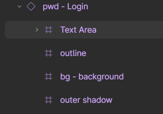

# HeartMelody：A Relieve Stress APP Prototype

> 本项目是作者在学习Unity时的一个实践项目。本项目主要内容是使用Figma Converter for Unity插件，将作者在《产品信息架构》课程上和组员一起完成的一款解压手机应用UI原型：心韵从Figma（一款UI原型制作软件）中导入到Unity中打包成一个可以在手机上运行的应用原型。
>
> 视频介绍：[使用Figma Converter for Unity插件将UI原型变为应用！_哔哩哔哩_bilibili](https://www.bilibili.com/video/BV1eoBKYkEEH/?spm_id_from=333.999.list.card_archive.click&vd_source=bf08880c4c4d8fdcca4d17ed2ee821fe)

### 更新说明：

**2024.12.15更新**

- 新增README.md
- 在README.md新增Figma Converter for Unity在Figma端的需要遵循的设计规范
- 新增Unity工程源码
- 为APP原型新增交互逻辑

**2024.12.16更新**

- 在README.md新增Figma Converter for Unity在Unity端的使用方法
- 优化APP原型的UI布局

### 1.项目文件说明

#### Software

Software目录中提供了视频里演示的软件原型HeartMelody的Unity工程源码

#### Docs

Docs目录中提供了Figma Converter for Unity插件作者编写的面向设计师和开发者的使用说明

#### images

images目录中存放REAMD.md中链接的插图

### 2.Figma UI原型说明

#### 2.1背景信息

在2023年秋《产品信息架构》课程上，我和我的组员搭建了心韵：一款面向大学生压力舒缓的软件UI原型。当时搭建原型是使用的软件是[Figma](https://www.figma.com/)，它是一款功能十分强大，使用体验非常优秀的UI设计软件。利用Figma的Prototype功能，我们在当时已经很好地实现了软件的各种交互。

#### 2.2软件架构

#### 2.3视觉系统

#### 2.4中保真交互UI原型

### 3.Figma Converter for Unity插件使用说明

#### 3.1F基本介绍

[Figma Converter for Unity]([Figma Converter for Unity | 实用工具 工具 | Unity Asset Store](https://assetstore.unity.com/packages/tools/utilities/figma-converter-for-unity-198134))是一款可以自动将Figma里的布局（Layout）导入成Unity的画布（Canvas）的插件，只需要轻轻一点，这款插件便可以自动完成所有的工作完成。

这里是该插件作者的官方网站：[D.A. Assets](https://da-assets.github.io/site/)，可以在上面找到插件使用说明和获取方式，有能力请支持正版。

#### 3.2在Figma端

##### 3.2.1布局规则

为了在使用该插件时减少奇怪的错误，需要遵守一些该插件强制规定的一些布局规则，下面是我列举的比较重要的布局规则

1. 在导入之前取消勾选框架（Frames）的`Clip Content`选项
2. 为了使资产能够正确导入 **Sections**（分区），你需要将这些分区放在 **Frame**（框架）中。
3. 标签后的文本内容不应该包含特殊字符。

4. 作者提供了很多的案例[Example templates](),可以让我们更好地了解在为导入而设计布局时，应该关注哪些方面。

##### 3.2.2命名和标签

在导入布局时，**标签（Tags）** 是用来指定某些对象的导入方式，或者用于将脚本分配给 Unity 中的一些对象。标签的使用有助于 Unity 正确识别和处理这些对象。大多数元素不需要标签。

下图是标签列表

参考案例

- btn-menu open
- bg-circle pattern
- img-avatar

##### 3.2.3图片和容器（Image/Container）

TODO

##### 3.2.5文本（Text）

如果你在 Figma 设计时为某个文本组件设置了不适合的值，特别是在 Unity 中使用算法或手动设置时，文本内容可能会超出组件的边界，导致显示问题。

正确的文本组件案例

##### 3.2.6按钮（Button）

如果希望在导入到 Unity 时，能够将按钮脚本自动附加到按钮的 **GameObject** 上，需要在 **Figma** 中的按钮名称前加上 **"btn"** 标签。

如果在 Unity 中使用 **"Unity Button"** 且没有定义按钮的不同状态（例如默认状态、按下状态等），并且希望按钮在被按下时能应用 **"Color Tint"** 动画（即按钮按下时颜色改变），那么按钮必须有一个 **"Target Graphic"**（目标图形）。通常，**Target Graphic** 是按钮的背景图像。为了使 Unity 在导入时自动将目标图形分配给按钮，你需要确保背景图像位于按钮的子对象层级的 **最底部**。也就是说，背景图像应该是按钮对象的 **最后一个子对象**。

##### 3.2.7输入框（Input Field）

如果你希望在 **Unity** 中自动为你的对象添加 **InputField** 脚本，你需要在 **Figma** 中的组件名称中包含 **"fld"** 标签。

如果你想创建一个 **密码输入框**，则可以使用 **"pwd"** 标签，这样 Unity 会为该输入框自动应用适用于密码输入的设置（比如遮掩输入的文本）。

如果输入框 包含多个图像元素（例如背景和轮廓），你应该为背景图像添加 **"bg"** 标签。这样可以确保 Unity 在导入时能够正确识别背景图像，并将其作为 **InputField** 的背景进行处理。

其他输入框的组件不需要添加标签

##### 3.2.8滚动视角（Scroll View）

如果希望在 Unity 中自动将 **ScrollView** 添加到场景中，需要确保 **ScrollView** 的层级结构如下图一致

如果希望在 **Unity** 导入时自动为某个组件添加 **"ScrollRect"** 脚本，你需要在 Figma 中将该组件的名称加上 **"scroll"** 标签。**"scroll"** 标签用于标识该组件是 **ScrollView** 的父容器，Unity 将会根据这个标签自动将 **ScrollRect** 脚本应用到该父组件上。
取消勾选该父组件的`Clip Content`选项

在 **Viewport** 上，你需要配置滚动原型（scroll prototype），并在其中设置 **Overflow** 属性，以控制滚动区域的溢出行为。**Overflow** 属性决定了在视口区域内内容的滚动方向。
支持的滚动选项：

- Horizontal
- Vertical 
- Both directions

##### 3.2.9切换键（Toggle/Checkbox）

1. 如果希望在 **Unity** 中自动为你的对象添加 **"Toggle"** 脚本（即开关按钮），需要在 **Figma** 中使用 **"tg"** 标签，并且在该对象上使用 **"Checkmark"** 关键字。
2. 在 **Toggle** 组件中，负责显示 **勾选标记**（即被选中时显示的图标）的对象应该命名为 **"Checkmark"**。这样，Unity 在导入时会自动识别这个对象作为 **Toggle** 的 **Checkmark**（勾选标记）。
3. 如果你的 **Toggle** 组件包含多个图像元素（例如背景和轮廓），你应该为背景图像添加 **"bg"** 标签，以便在 Unity 导入时正确识别并将其作为背景处理。
4. 如果你想在 **Unity** 中将多个 **Toggle** 组件进行分组，你需要为它们的共同父对象添加 **"tgr"** 标签。这个带有 **"tgr"** 标签的父对象可以位于层级结构的任何位置，并且可以分组任意数量的 **Toggle**。
5. 

##### 3.2.10忽略对象（Ignore）

添加上`ignore`标签的对象和它的子对象都会不会在导入过程中导入Unity

##### 3.2.11UI Responsivity

TODO

##### 3.2.12Shadows  and  True Shadow  asset

TODO

以上为了更优雅的使用该插件在Figma端的需要遵循的设计规范，还有更多的细节可以参考插件作者所写的[Manual for designers.pdf](Docs/Manual%20for%20designers.pdf)

#### 3.3在Unity端

在使用Figma Converter for Unity插件前，需要完成一些准备工作：安装依赖的包，添加Figma账户认证信息等，如下是在一个新的项目中使用该插件的详细步骤

##### 3.3.1安装依赖的包

1. 安装"Json.NET"
2. 导入"Figma Converter for Unity"到资产中

##### 3.3.2新建"FigmaConverterUnity"脚本对象

- 在场景中新建一个空的游戏物体，并在其上通过搜索组件添加一个"FigmaConverterUnity"脚本

##### 3.3.3添加Figma账户认证信息

1. 下面添加Figma账户认证信息，点击这个脚本上的设置按钮

   

2. 打开`Figma AUTH`页面点击`Sign In With Web Browser`按钮

   

3. 在浏览器中点击`Allow access`按钮

##### 3.3.4导入Figma框架（Frame）

1. 复制你所要导入的Figma框架所在的项目（Project）的链接到下图框中
   链接示例: https://www.figma.com/file/XXXXXXXXXXXXXXXXX..

2. 点击下载按钮获得该项目中所有页面和框架（frames）的列表。

3. 选择想要导入的框架（frames），点击导入按钮导入，在导入成功后你将在控制台中看到“Import complete!”

以上是该插件最重要的使用方式，还有更多的细节可以参考插件作者所写的[Manual for developers.pdf](Docs/Manual%20for%20developers.pdf)

#### 3.4修改布局和名称后的UI原型（部分）

### 4.Unity app原型说明

#### 4.1设置摄像机尺寸

TODO

#### 4.2交互代码编写

TODO

#### 4.3打包成安卓APK文件

TODO
